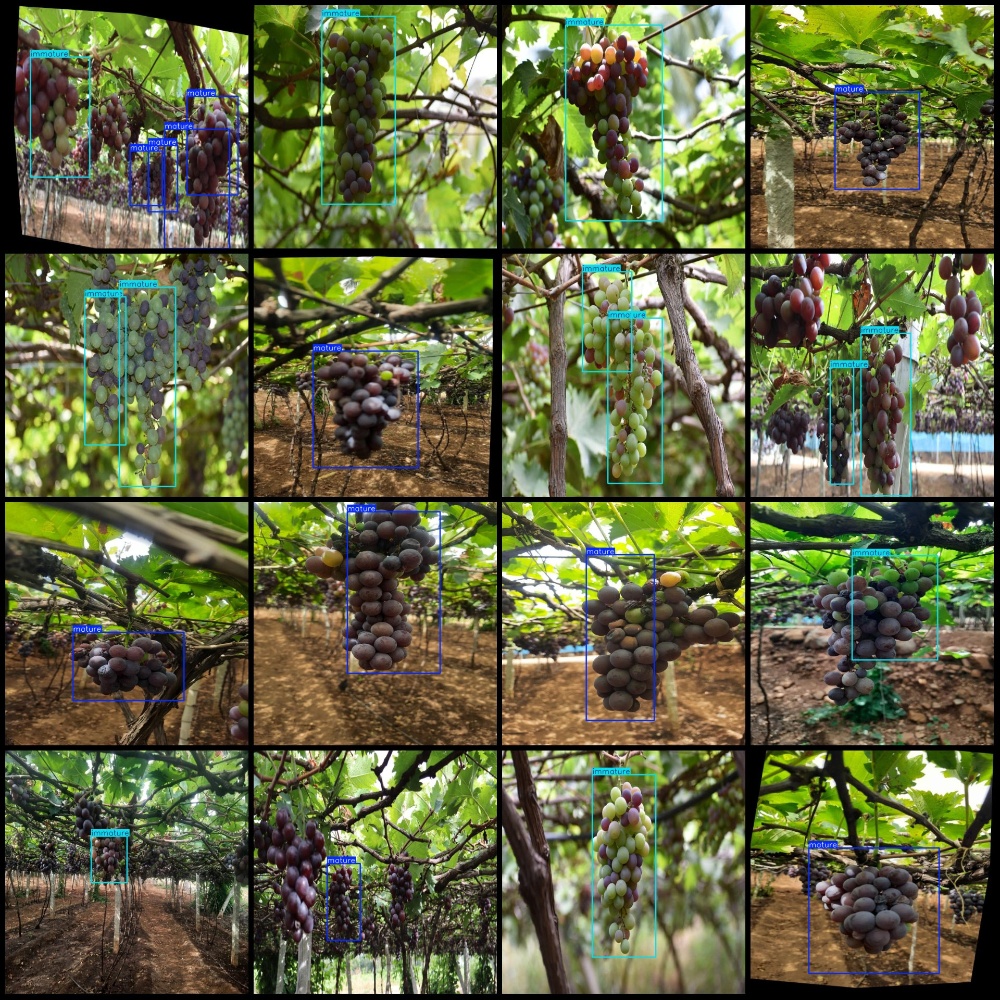
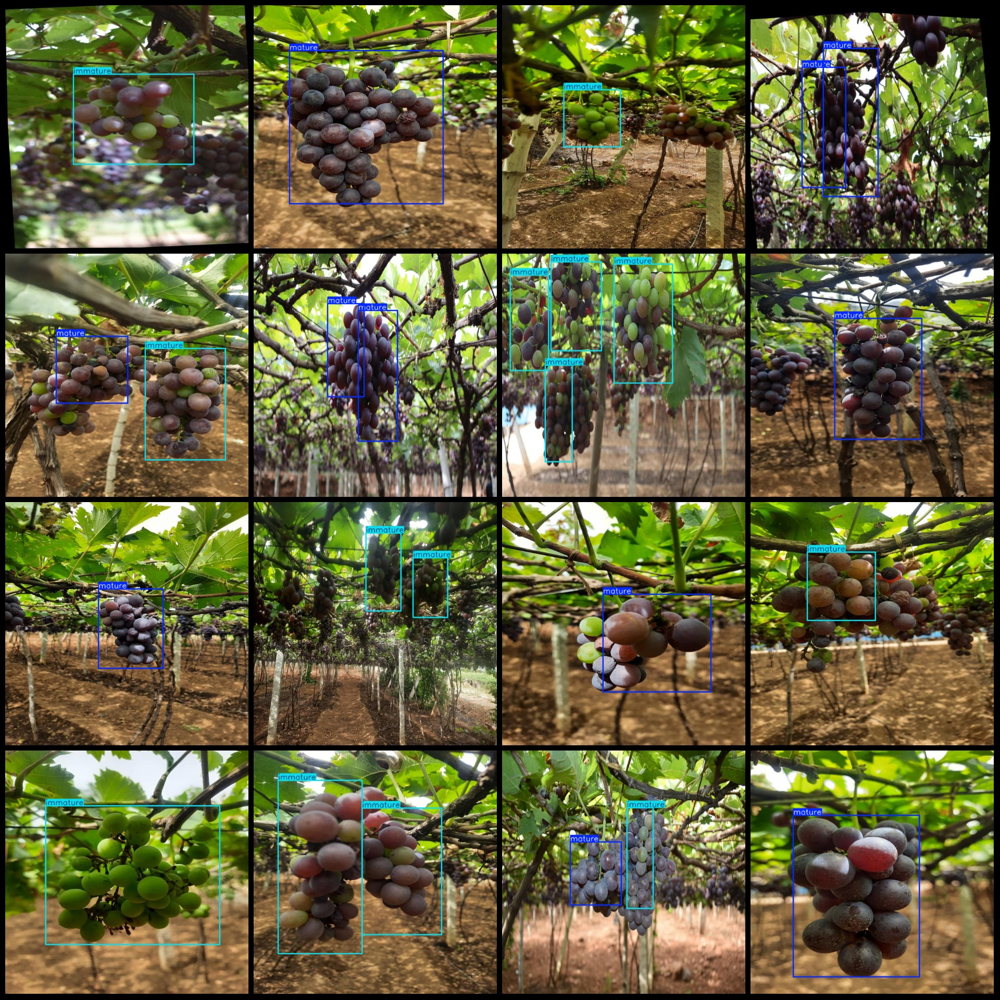

# Tree Virus Identification Dataset (VOC+YOLO) - 690 Images of Two Categories

The dataset format follows Pascal VOC and YOLO specifications (excluding the split directory, only containing JPG images along with their corresponding VOC and YOLO txt files). The image count is 690. The number of annotations is 690, consisting of XML files, txt files, and JPG images. The number of categories is 2. The labels are in the ["immature", "mature"] order as specified in the labels folder's classes.txt file.

- For the "immature" category, there are 352 bounding boxes.
- For the "mature" category, there are 590 bounding boxes.
- Total bounding boxes: 942.
- Image resolution: 640x640.
- The dataset includes both original and rotated images for enhancement.
- Annotation tools used: labelImg.
- Annotation rules: draw bounding boxes for each category.
- Note: There are no explicit statements about important notes or special declarations.
- This dataset does not guarantee the accuracy of models trained on it or any associated weight files.

Image previews are not provided due to the constraints of this platform.

Annotation examples:

## Images

Here is a pay link on Stripe ( https://buy.stripe.com/3cs8yP7sY87d0vu9AB ). Please contact me lonlonago@foxmail.com after funding $89, and I will send you a complete data files , thank you!

